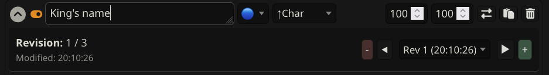
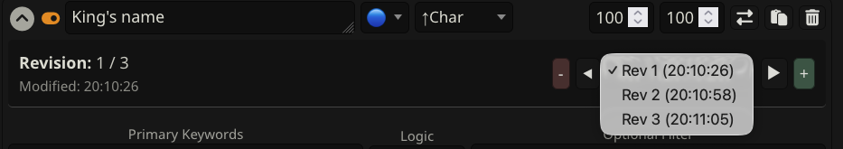
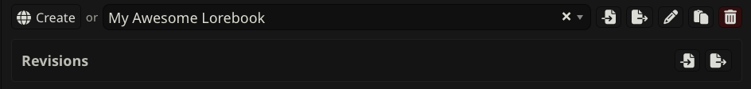
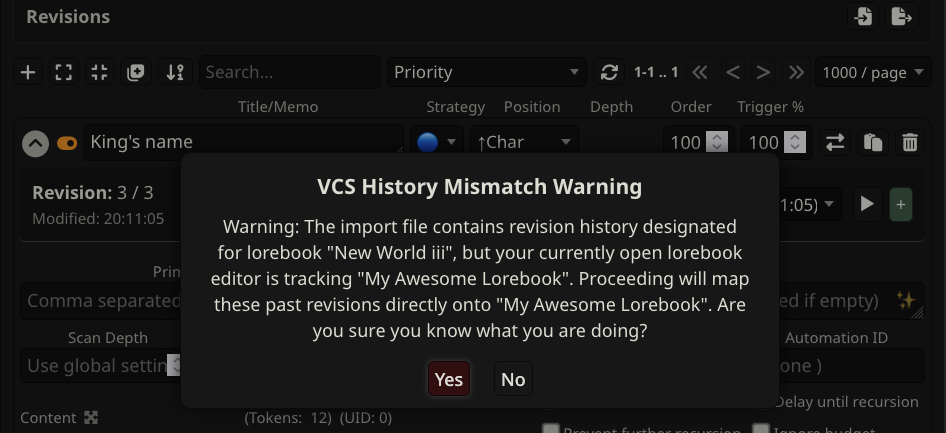

# SillyTavern-LoreEntryVCS

## Overview
SillyTavern-LoreEntryVCS is a Node.js/npm-compatible third-party extension designed for SillyTavern. It introduces an inline Version Control System (VCS) to track, snapshot, and swap between historical revisions of your Lorebook entries directly inside the World Info editor UI.

## Warning
> **Always backup your world info files before using this extension. This extension will overwrite your world info entries with the revision you choose.**
>
> It is recommended to back your world info before you start adding revisions in case of some bug or unexpected behavior. You can also export it after each revision (or multiple revisions) since from ST's point of view, there is only one world info file and revisions are stored separately in extension settings.

## Features
* **Granular Revision Tracking**: Takes snapshot revisions of lorebook entry text fields and checkbox configurations instantly.
* **Timeline Navigation**: Use simple navigation arrows (◀ / ▶) or a dynamic timestamped dropdown menu to travel through entry history.
* **Offline Desynchronization Safety**: Automatically detects if native edits occurred outside the VCS timeline and generates automated recovery nodes.
* **Global Backup Framework**: Import and export your entire version history mapping via standard JSON layout profiles.
* **Life-Cycle Integrity Hooks**: Seamlessly syncs tracking configurations during target world info deletion, entry erasure, or book renames.

## Directory Structure
```text
SillyTavern-LoreEntryVCS/
├── img/
│   ├── global_vcs_panel.png
│   ├── entry_revision_panel.png
│   ├── import_mismatch_warning.png
│   └── revision_dropdown_select.png
├── conf.js
├── LICENSE
├── index.js
├── utils.js
├── README.md
├── style.css
└── manifest.json
```

## Interface Screenshots
Here are visual references of the extension's features in action:

### 1. Entry Revision Panel Layout


*Visual display of the inline revision toolbar inside each Lorebook entry container.*

### 2. Revision History Selection


*The dropdown menu listing past saved versions with timestamps.*

### 3. Global Import & Export Toolbar


*The injected global Revisions panel located at the upper section of SillyTavern's primary World Info modal window.*

### 4. Database Identity Mismatch Popup


*The safety popup notice generated when trying to import revision history belonging to a different lorebook ID.*

## Installation

### Via SillyTavern Extension Installer (Recommended)
1. Open SillyTavern and navigate to the **Extensions** menu (via the blocks/puzzle icon in the top bar).
2. Click the **Install extension** button.
3. In the text field asking for the Git URL of the extension to install, paste the following link:
   ***
   https://github.com/Enerccio/SillyTavern-LoreEntryVCS
   ***
4. Click **Install for all users** or **Install just for me** depending on your deployment preferences.
5. Wait for the installation completion confirmation and refresh your browser window.

### Manual Installation
1. Clone or download this repository folder.
2. Move or copy the entire *SillyTavern-LoreEntryVCS* directory into your active SillyTavern installation path under:
   *public/ThirdParty/extensions/SillyTavern-LoreEntryVCS*
3. Restart your active SillyTavern server backend instance or reload the web interface.

## License
This software utility is distributed under the conditions of the open-source MIT License.
